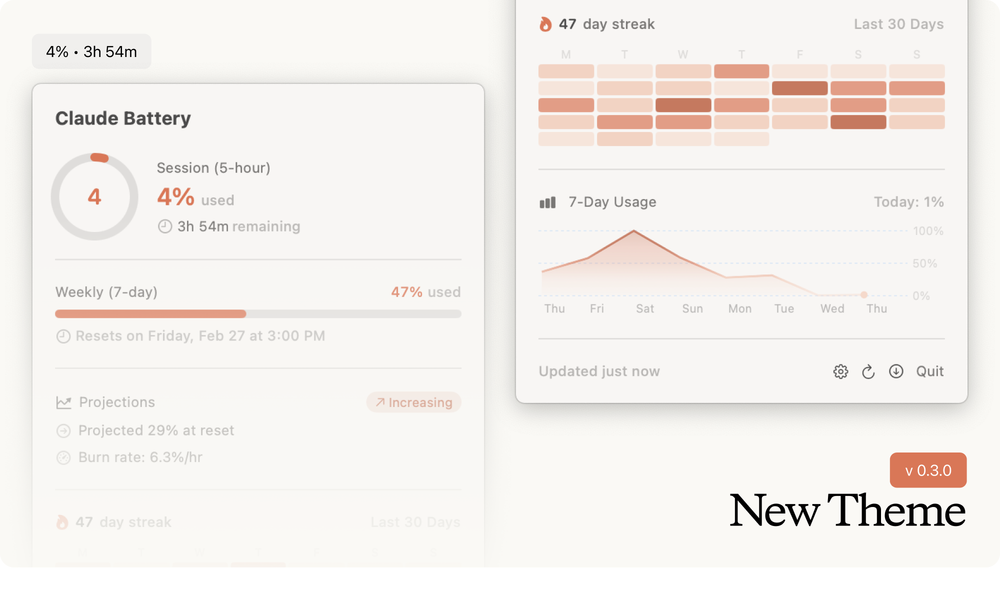
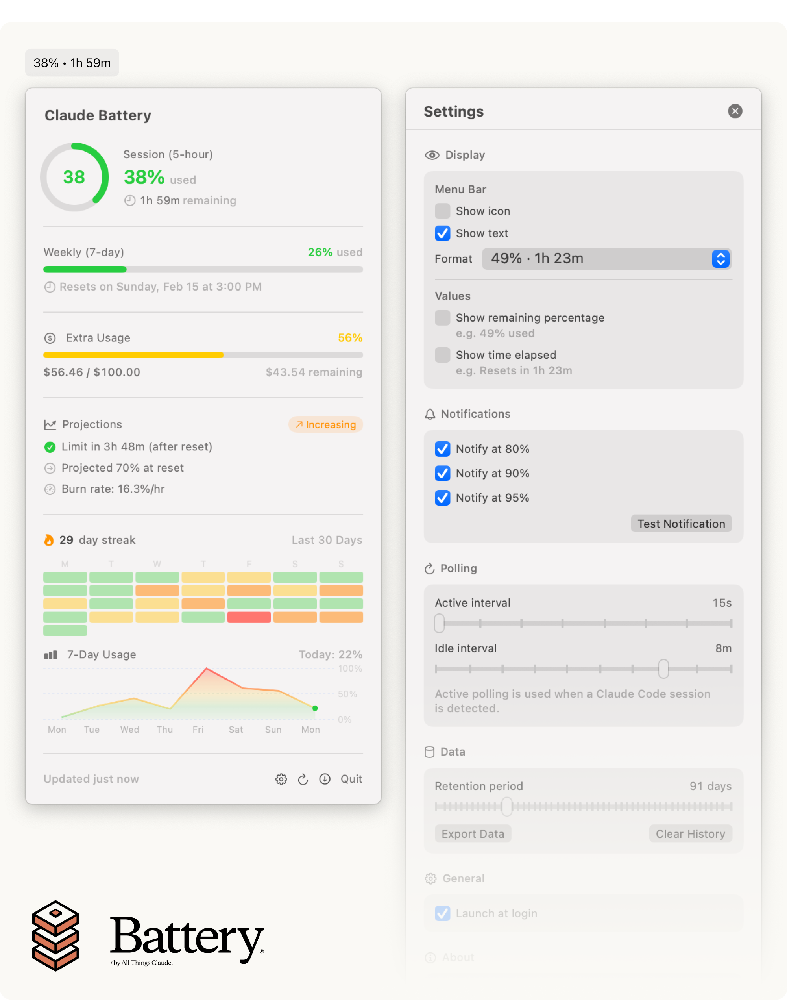

# Battery
> by All Things Claude




A macOS menu bar app that monitors your Claude Code API usage in real time.

Battery lives in your menu bar and shows how much of your Claude Code rate limit you've used across both the 5-hour session window and the 7-day weekly window. It helps you pace your usage, avoid hitting limits unexpectedly, and stay informed about your consumption patterns.

## Features

- **Session & weekly gauges** - Circular progress rings showing utilization for both the 5-hour and 7-day rate limit windows
- **Opus tracking** - Separate gauge for Opus model usage when applicable
- **Extra usage monitoring** - Track overuse credits and monthly spending limits
- **Burn rate projections** - Linear regression on recent snapshots predicts when you'll hit your limit and what your utilization will be at reset
- **Usage streaks & heatmap** - See your daily activity patterns, current streak, and a GitHub-style contribution heatmap
- **7-day usage chart** - Area chart showing your daily usage trends over the past week
- **Multi-account support** - Manage up to 5 Claude accounts and switch between them
- **Color themes** - Choose between a default claude theme and a classic multi-color theme
- **Configurable notifications** - Get alerted at 80%, 90%, and 95% thresholds (customizable)
- **Session detection** - Integrates with Claude Code hooks to detect active coding sessions and poll more frequently
- **Auto-updates** - Built-in Sparkle updater checks for new versions automatically
- **Menu bar display modes** - Show percentage + time, percentage only, time only, or just an icon

## Install

### Homebrew

```bash
brew tap allthingsclaude/battery https://github.com/allthingsclaude/battery.git
brew install --cask claude-battery

# Launch
claude-battery
```

### Manual

Download the latest DMG from [Releases](https://github.com/allthingsclaude/battery/releases), open it, and drag Battery to Applications.

## Prerequisites

Battery authenticates via OAuth using the same credentials as Claude Code. You need:

1. **Claude Code** installed and authenticated (this creates the OAuth tokens Battery uses)
2. **macOS 13.0** (Ventura) or later

On first launch, Battery will prompt you to sign in. It automatically refreshes your OAuth tokens as needed. Credentials are stored locally in `~/.battery/tokens/` with restricted file permissions (0600) rather than in the macOS Keychais, avoiding the repeated "enter your keychain password" prompts that occur after restarts and app updates.

## Session Detection (Optional)

For smarter polling (faster updates during active coding, slower when idle), you can install the Battery hook for Claude Code. Add this to your Claude Code hooks configuration:

```json
{
  "hooks": {
    "SessionStart": [{ "command": "/path/to/battery-hook.sh SessionStart" }],
    "SessionEnd":   [{ "command": "/path/to/battery-hook.sh SessionEnd" }],
    "PostToolUse":  [{ "command": "/path/to/battery-hook.sh PostToolUse" }],
    "Stop":         [{ "command": "/path/to/battery-hook.sh Stop" }]
  }
}
```

The hook script is at `Hooks/battery-hook.sh` in this repo.

## Building from Source

Battery is a SwiftPM project with no Xcode project file required.

```bash
# Development build + run
./Scripts/dev.sh

# Or manually
swift build
./Scripts/bundle.sh debug
open Battery.app
```

### Requirements

- Swift 5.9+
- macOS 13.0 SDK

### Dependencies

- [SQLite.swift](https://github.com/stephencelis/SQLite.swift) - Local database for usage history
- [Sparkle](https://github.com/sparkle-project/Sparkle) - Auto-update framework

## How It Works

Battery polls the Anthropic OAuth usage API at regular intervals (30s during active sessions, 5m when idle) and displays the results as circular gauges in a menu bar popover. Usage snapshots are stored in a local SQLite database, enabling burn rate projections and historical stats.

The app runs as a menu bar extra (`LSUIElement`) with no Dock icon. All data stays local on your machine.

## License

MIT
